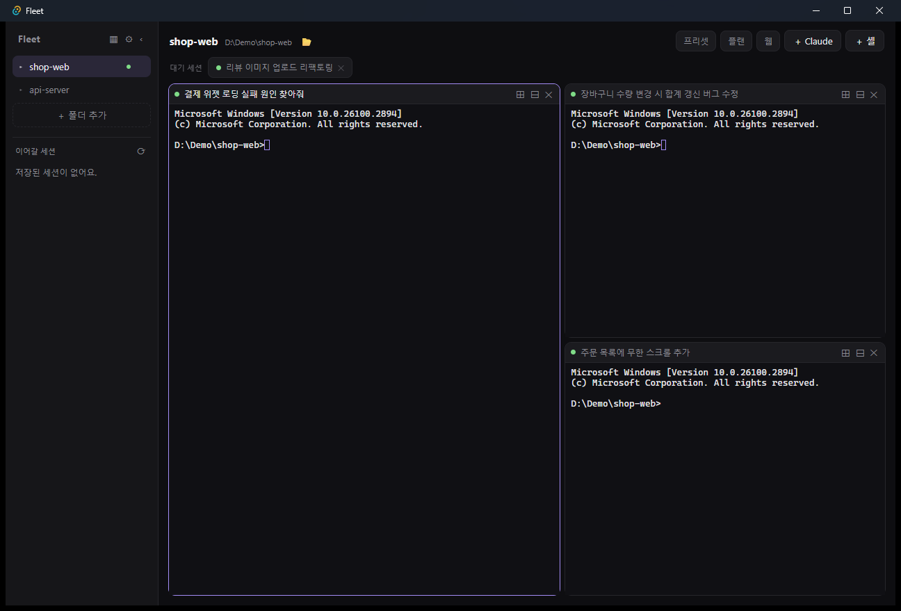

# Fleet

여러 프로젝트의 `claude` 세션을 한 화면에서 관리하는 데스크탑 앱 (Mac / Windows).

각 프로젝트는 **독립된 PTY 터미널**에서 실제 인터랙티브 `claude`를 실행합니다.
헤드리스(`claude -p`)가 아니라 로그인된 구독 세션을 그대로 쓰므로 추가 API 과금이 없습니다.



## 스택

- **Tauri 2** (Rust 백엔드 + React/TS 프론트엔드)
- **portable-pty** — 크로스플랫폼 PTY (macOS openpty / Windows ConPTY)
- **xterm.js** — 터미널 렌더링

## 구조 (기능별)

```
src-tauri/src/  (Rust — 얇은 PTY + 파일시스템 서비스, 관심사별 모듈)
  lib.rs        모듈 루트: 플러그인·상태·invoke_handler 등록
  pty.rs        PTY 세션 (spawn/write/resize/kill)
  sessions.rs   claude 세션 검색 (resume 목록)
  config.rs     fleet.json 저장/로드
  bridge.rs     Claude Code 훅 브리지 (로컬 HTTP :47100) + 훅 설치
  attach.rs     파일/이미지 첨부 (임시 저장 + OS 클립보드 경로 읽기)
  webtabs.rs · cdp.rs · git.rs · exec.rs · diagnostics.rs

src/api/        Rust 커맨드 래퍼 (pty · config · claude · attach · web · cdp · system …)
src/lib/        layout.ts(분할 트리) · activity.ts · worktree.ts · webAdapters.ts …
src/hooks/      useFleet.ts (중앙 상태/액션 — 모든 mutation이 여기로)
src/features/
  projects/     ProjectRail (좌측 레일)
  terminals/    Terminal · ProjectView · SplitLayout · imeBridge · attachFiles
  attention/    AttentionPeek (⌘J 크로스 프로젝트 트리아지)
  overview/     OverviewPanel (⌘⇧J 전체 프로젝트 오버뷰)
  blocks/       CommandPalette (⌘K)
  drawer/ board/ plan/ presets/ settings/ web/
src/styles/global.css · types.ts · App.tsx (조립만)
```

설정(프로젝트·터미널·레이아웃·프리셋·큐보드·플랜)은 OS 설정 폴더의 `fleet.json`에 저장됩니다.
`FLEET_CONFIG_DIR` 환경변수로 다른 폴더를 지정하면 격리 프로필로 실행할 수 있습니다(데모/개발용).

## 실행

### 빠른 셋업 (개발자용)

필요한 도구(Node·Rust)를 감지해 **설치 전 물어본 뒤** 설치하고, `npm install` 후 바로 실행합니다. 자세한 설명은 [`scripts/README.md`](scripts/README.md) 참고.

```bash
# macOS / Linux
./scripts/macos/setup.sh           # 의존성 설치 후 dev 실행 (기본)
./scripts/macos/setup.sh build     # 배포 번들(.dmg/.app) 생성
./scripts/macos/setup.sh install   # 의존성만 설치

# Windows (PowerShell)
.\scripts\windows\setup.ps1                                # dev 실행 (기본)
.\scripts\windows\setup.ps1 build                          # 배포 번들(.msi/.exe) 생성
powershell -ExecutionPolicy Bypass -File .\scripts\windows\setup.ps1   # 실행정책 막힐 때
```

> 인자: `dev`(기본) / `build` / `install`, 그리고 확인 없이 진행하는 `-y`(sh)·`-Yes`(ps1).
> Windows는 `winget`으로 Node·Rust를 설치합니다. Rust 설치 직후엔 PATH 반영을 위해 **새 터미널에서 한 번 더** 실행해야 할 수 있어요. MSVC C++ 빌드툴이 없으면 설치 명령을 안내합니다.
>
> **최종 사용자는 Rust/Node가 전혀 필요 없습니다.** `build`로 만든 `.msi`/`.dmg`만 설치하면 됩니다 (앱은 이미 컴파일된 네이티브 실행파일). Windows는 WebView2 런타임만 필요한데 Win11 기본 내장이고, 없어도 설치 마법사가 자동으로 받습니다.

### 수동 실행

```bash
npm install
npm run tauri dev      # 개발
npm run tauri build    # 배포 번들 (.app / .dmg / .msi)
```

## 동작 원리

- 프로젝트 추가 -> 그 폴더에서 기본 셸을 PTY로 띄우고 `startup`(기본 `claude`)을 타이핑
- **공통 블럭** -> 저장된 프롬프트를 카드별/전체 세션에 텍스트+엔터로 주입
- 상태뱃지(`busy`/`idle`/`waiting`/`stopped`)는 **Claude Code 생명주기 훅**으로 판정. 각 PTY에 `FLEET_TERM_ID`를 심고, 설치된 훅(`Stop`·`UserPromptSubmit`·`PreToolUse`·`Notification`)이 로컬 서버(`:47100`)로 이벤트를 POST → 작업중/완료/**승인 대기**를 정확히 구분하고, `PreToolUse`로 "지금 뭘 하는 중인지"(파일/명령)를 실시간 표시. 훅이 안 붙은 세션은 화면에서 `esc to interrupt` 힌트를 스캔하는 폴백으로 판정

## 기능

**프로젝트 · 터미널**

- [x] **폴더(프로젝트) 관리**: 좌측 레일에서 폴더 추가/선택/드래그 정렬
- [x] **패널이 곧 탭**: 별도 탭줄 없이 각 패널의 제목바가 핸들 — 드래그해서 재배치(VS Code식 존 분할), ✕는 세션 종료. 화면에 안 놓인 세션만 상단 **대기 세션** 칩으로 표시(클릭해 열기, 드래그해 배치)
- [x] **세션 제목 자동**: 각 claude 세션의 첫 프롬프트가 패널 제목이 됨 → "Claude 2"가 아니라 "무슨 작업 중인지"가 보임. 더블클릭으로 직접 이름을 정하면 그 뒤로는 자동 제목이 덮어쓰지 않음
- [x] **분할 보기**: 패널 좌우(⊞)/상하(⊟) 분할, 분할선 드래그로 크기 조절
- [x] **스크롤백 유지**: 패널을 옮겨도 터미널 내용 보존 (PTY 항상 마운트, 위치만 이동)
- [x] **파일/이미지 첨부**: 스크린샷을 터미널에 붙여넣으면(⌘/Ctrl+V) 임시 파일로 저장해 **경로를 대신 입력**. 탐색기/Finder에서 복사한 파일·**폴더**를 붙여넣으면 **실제 경로**가 그대로 입력(임시 복사 없음). 파일을 패널로 드래그&드롭해도 동일
- [x] **쉬운 resume**: 좌측 사이드바에 그 폴더의 과거 claude 세션 목록 → 한 번 클릭으로 `claude --resume`
- [x] **크로스 프로젝트 트리아지**: ⌘J — 모든 프로젝트의 살아있는 세션을 대기→유휴→작업중 순으로 한 화면에서 훑고 점프. ⌘⇧J — 프로젝트별 세션+플랜/보드 진행까지 묶은 전체 오버뷰. 레일에는 프로젝트별 승인 대기 뱃지
- [x] **폴더 열기**: 상단 헤더의 경로 옆 📂 버튼 → OS 파일 탐색기로 해당 폴더 열기

**프롬프트 · 자동화**

- [x] **공통 블럭 + ⌘K 팔레트**: ⌘K로 블럭 검색 → Enter(현재 터미널) / Shift+Enter(전체 전송)
- [x] **작업 큐 보드**: 프로젝트별 보드 — 레인(터미널)마다 태스크를 쌓고, 레인 간 **의존성**(`deps`) 설정 가능. 실행하면 의존성 없는 레인은 병렬로, 의존 체인은 순서대로 자동 진행(태스크의 터미널이 idle이 되면 다음으로)
- [x] **웹 AI 동시 전송**: 헤더 `웹` 버튼 → 한 프롬프트를 여러 AI 사이트에 동시 전송 (과금 X, 로그인 세션 사용). 두 경로:
  - **임베드 창**: 사이트를 네이티브 webview 창으로 열어 JS 주입 — claude.ai/Gemini 등 무난한 사이트용 (설치·로그인 외 준비 0)
  - **CDP(실제 Chrome 제어)**: ChatGPT처럼 임베드(봇 차단)가 막히는 사이트는 Fleet이 **원격 디버깅 모드의 실제 Chrome**(전용 프로필)을 띄워 DevTools 프로토콜로 주입. 확장/유저스크립트 설치 불필요, **로그인 1회**만. Chrome 탐색·실행·주입은 `cdp_open`/`cdp_targets`/`cdp_eval` (Rust, `tungstenite` WS)
  - 사이트별 DOM 셀렉터는 어댑터(`src/lib/webAdapters.ts`)로 격리. ⌘K 블럭 broadcast도 함께 전송됨

**시스템**

- [x] **OS 알림**: 응답 완료 시 / 권한 승인 대기 시 시스템 알림 (훅 기반이라 정확)
- [x] **설정 패널**: 진단 정보(경로·훅 설치 상태), 폴더 다시 연결, 훅 재설치
- [x] **자동 업데이트**: 실행 시 새 버전 확인 → 알림 → 다운로드/설치/재시작
- [x] **단축키** (macOS=⌘ · Windows/Linux=Ctrl): K 팔레트 · J 트리아지 · ⇧J 오버뷰 · T 새 터미널 · W 닫기 · 1~9 프로젝트 전환 (UI 라벨도 OS에 맞춰 ⌘/Ctrl 표시)

## 구현 메모

- 터미널은 절대좌표 오버레이로 패널 위에 띄움 → 재배치 시 xterm을 재생성하지 않아 스크롤백이 유지됨
- 분할 레이아웃은 재귀 트리(`src/lib/layout.ts`), 프로젝트별로 `fleet.json`에 영속화
- **한글/CJK IME는 `imeBridge.ts`가 전담**: xterm의 조합 처리를 완전히 차단하고, 숨은 textarea를 PTY로 실시간 미러링(변경된 꼬리만 DEL+재타이핑). macOS WKWebView(조합 이벤트 없음)와 Windows WebView2(지연 커밋) 양쪽의 자음모음 분리/글자 유실을 한 방식으로 해결. blur 시 상태를 리셋해 포커스 복귀 후 첫 글자 깨짐/입력 유실도 방지
- 파일 첨부: 웹뷰는 드롭/붙여넣기 파일의 OS 경로를 못 보므로(내부 패널 드래그 때문에 `dragDropEnabled: false`), 바이트는 `<temp>/fleet-attach/`에 저장해 경로를 입력하고, 복사된 파일·폴더는 Rust가 OS 클립보드(CF_HDROP 등)에서 **실제 경로**를 읽어 입력
- resume 목록: `~/.claude/projects/<encoded-cwd>/*.jsonl`의 첫 유저 메시지를 요약으로 추출 (인코딩 매칭은 Windows 드라이브 문자 대소문자 버그 때문에 대소문자 무시)
- 훅은 `~/.claude/settings.json`에 멱등하게 병합(기존 훅 보존) — `Stop`·`UserPromptSubmit`·`PreToolUse`·`Notification` 이벤트를 사용

## 로드맵

- [ ] 블럭 변수 치환(`{{branch}}` 등)
